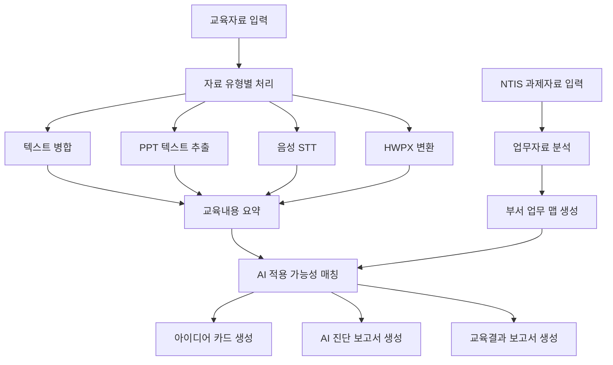

# Edu2WorkAI

**AI 교육자료와 부서 업무자료를 연결하여 실무 적용 아이디어와 보고서 초안을 생성하는 프로그램**

Edu2WorkAI는 AI 교육을 수강한 뒤, 교육 내용이 실제 업무에 어떻게 활용될 수 있는지 정리하기 위해 만든 데스크톱 프로그램입니다.
PPT, 음성 강의, 텍스트 자료, HWPX 문서, NTIS 과제자료 등을 입력하면 교육 내용과 부서 업무를 연결하여 AI 활용 아이디어와 보고서 초안을 자동으로 생성합니다.

---

## 1. 개발 목적

AI 교육을 듣고 나면 “무엇을 배웠는가”는 정리할 수 있지만,
“우리 업무에 어떻게 적용할 것인가”를 구체적으로 작성하는 것은 쉽지 않습니다.

Edu2WorkAI는 이 문제를 해결하기 위해 다음 과정을 자동화합니다.

* 교육자료 정리
* 부서 업무자료 분석
* AI 적용 가능 업무 도출
* 활용 아이디어 생성
* 교육결과 보고서 초안 작성

핵심 목표는 단순 요약이 아니라,
**AI 교육내용을 실제 업무 개선 아이디어로 연결하는 것**입니다.

---

## 2. 핵심 기능

| 기능         | 설명                                            |
| ---------- | --------------------------------------------- |
| 교육자료 통합    | TXT, MD, PPTX, 음성파일, HWPX 등을 하나의 교육자료로 정리     |
| 음성 인식      | MP3, WAV, M4A, MP4 등의 강의 녹음을 텍스트로 변환          |
| PPT 추출     | PPT/PPTX 슬라이드의 텍스트를 추출                        |
| HWPX 처리    | HWPX 문서를 감지하고 텍스트 변환을 시도                      |
| NTIS 분석    | NTIS 과제 CSV를 기반으로 업무자료를 구조화                   |
| 업무 맵 생성    | 부서 업무를 주요 영역별로 정리                             |
| 아이디어 카드 생성 | 교육내용과 업무자료를 연결해 AI 활용 아이디어 생성                 |
| 보고서 생성     | 교육결과 보고서, AI 진단 보고서, 최종 보고서 초안 생성             |
| LLM 연동     | OpenAI-compatible API 사용 가능, 실패 시 fallback 동작 |

---

## 3. 전체 구조



---

## 4. 처리 흐름

전체 파이프라인은 다음 9단계로 실행됩니다.

```text
1. init
2. transcribe-audio
3. extract-ppt
4. convert-docs
5. process-education
6. process-reports
7. build-map
8. generate-ideas
9. export
```

한 번에 실행하려면 다음 명령을 사용합니다.

```bash
py -3 -m app.main run-all
```

---

## 5. 입력 파일

### 교육자료

교육자료는 다음 폴더에 넣습니다.

```text
workspace/01_education_raw/
```

지원 형식:

```text
txt, md, pptx, ppt, mp3, wav, m4a, mp4, aac, flac, hwpx, hwp
```

### NTIS 과제자료

NTIS CSV 파일은 다음 폴더에 넣습니다.

```text
workspace/03_ntis_raw/
```

---

## 6. 주요 출력 파일

분석이 완료되면 다음 결과물이 생성됩니다.

```text
workspace/02_education_processed/education_summary.md
workspace/02_education_processed/education_concepts.json

workspace/05_department_analysis/department_work_map.json
workspace/05_department_analysis/department_timeline.md

workspace/06_matching_output/idea_cards.md
workspace/06_matching_output/idea_cards.json

workspace/07_final_report/AI_diagnosis_report.md
workspace/07_final_report/education_result_report.md
workspace/07_final_report/final_report_draft.md
```

---

## 7. GUI 실행

GUI로 실행할 수 있습니다.

```bash
py -3 -m app.gui
```

또는 배포판에서는 다음 파일을 실행합니다.

```text
Edu2WorkAI.exe
```

GUI에서는 다음 작업을 할 수 있습니다.

* 교육자료 선택
* NTIS CSV 선택
* 분석 실행
* 진행 로그 확인
* 결과 폴더 열기

---

## 8. LLM 설정

Edu2WorkAI는 OpenAI-compatible API를 사용할 수 있습니다.
API Key는 보안을 위해 `config.json`에 직접 저장하지 않고 환경변수로 설정합니다.

PowerShell 예시:

```powershell
$env:OPENAI_API_KEY="YOUR_API_KEY"
```

`config.json` 예시:

```json
{
  "LLM": {
    "enabled": true,
    "provider": "openai_compatible",
    "base_url": "https://api.openai.com/v1",
    "model": "gpt-4o-mini",
    "api_key_env": "OPENAI_API_KEY",
    "timeout": 60,
    "temperature": 0.2,
    "max_tokens": 1500,
    "max_input_chars": 6000
  }
}
```

API Key가 없거나 사용량 제한이 발생해도 프로그램은 중단되지 않습니다.
이 경우 rule-based fallback 방식으로 결과물을 생성합니다.

---

## 9. 프로젝트 구조

```text
Edu2WorkAI/
├─ app/
│  ├─ main.py
│  ├─ gui.py
│  ├─ pipeline.py
│  ├─ config.py
│  ├─ llm_client.py
│  └─ modules/
│     ├─ education_processor.py
│     ├─ report_parser.py
│     ├─ department_mapper.py
│     ├─ idea_generator.py
│     ├─ exporter.py
│     ├─ stt_processor.py
│     ├─ ppt_processor.py
│     └─ document_converter.py
├─ workspace/
├─ config.json
├─ requirements.txt
├─ README.md
└─ gui_launcher.py
```

---

## 10. 패키징

PyInstaller를 이용해 Windows 실행 파일로 패키징할 수 있습니다.

```powershell
py -3 -m PyInstaller ^
  --name Edu2WorkAI ^
  --noconfirm ^
  --clean ^
  --windowed ^
  --collect-all customtkinter ^
  --collect-all pptx ^
  --collect-all faster_whisper ^
  --add-data "config.json;." ^
  --add-data "README.md;." ^
  --add-data "app;app" ^
  gui_launcher.py
```

배포 시에는 `Edu2WorkAI.exe` 하나만 전달하지 않고,
`dist/Edu2WorkAI/` 폴더 전체를 압축하여 전달합니다.

---

## 11. 현재 제한사항

* HWPX는 기본 텍스트 추출 중심이며, 복잡한 서식은 완벽히 복원되지 않을 수 있습니다.
* 이미지로만 구성된 PPT 슬라이드는 텍스트 추출이 제한됩니다.
* 음성 인식은 처음 실행 시 모델 로딩 때문에 시간이 걸릴 수 있습니다.
* OpenAI API 사용량 제한이 있으면 LLM 대신 fallback 결과가 생성됩니다.
* 현재 버전은 발표 및 내부 실증용 프로토타입입니다.

---

## 12. 발표용 요약

Edu2WorkAI는 AI 교육자료를 단순히 요약하는 도구가 아닙니다.
교육에서 배운 AI 개념과 실제 부서 업무자료를 연결하여,
**우리 업무에서 AI로 바꿀 수 있는 부분을 찾는 자동화 도구**입니다.

핵심 가치는 다음과 같습니다.

> AI 교육을 업무 변화로 연결한다.
